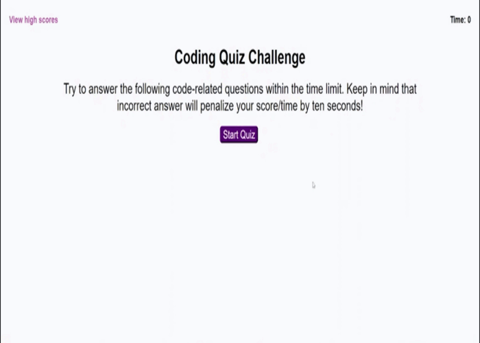

# D4-Quiz
Evaluación sobre codificación

## Descipción
* Se creo cuestionario cronometrado sobre los fundamentos de JavaScript, al contestar incorrectamente se restan 10 segundos del reloj. Al finalizar se almacenan las puntuaciones más altas.

## Captura de pantalla
El siguiente GIF demuestra la apariencia y funcionalidad de la aplicación web:

## Enlaces
URL de GitHub
* https://caro2102.github.io/D4-Quiz/

URL de repositorio de GitHub
* https://github.com/Caro2102/D4-Quiz
